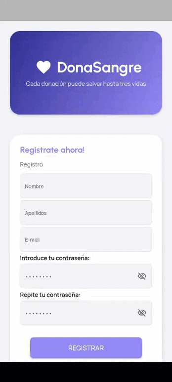

# 🏥 App Sanitaria

Aplicación móvil desarrollada en **FlutterFlow / Flutter / Dart** para gestionar y visualizar información sanitaria.  
Está pensada para ejecutarse en **Android** (Android Studio) y es totalmente escalable.

---

## ✨ Características

- Desarrollo con **FlutterFlow** para prototipado rápido.
- Código base en **Flutter/Dart** totalmente editable.
- Ejecución en **Android Studio** con emuladores o dispositivos reales.
- Diseño **responsive** y adaptable a diferentes tamaños de pantalla.
- Preparada para integraciones futuras (Firebase, APIs, exportación de datos).

---

## 📸 Vista previa

### Demo en GIF



*(El GIF muestra cómo navegar por la aplicación en pocos segundos)*

---

## 🛠️ Tecnologías

- [Flutter](https://flutter.dev/) (Framework para UI multiplataforma)
- [Dart](https://dart.dev/) (Lenguaje de programación)
- [FlutterFlow](https://flutterflow.io/) (Plataforma low-code utilizada en el diseño inicial)
- [Android Studio](https://developer.android.com/studio) (Entorno de desarrollo)

---

## 🚀 Instalación y ejecución

1. Clona este repositorio:
   ```bash
   git clone https://github.com/marcosandrada/appsanitaria.git
   ```

2. Abre el proyecto en **Android Studio** o en tu editor favorito (ej: VSCode).

3. Asegúrate de tener **Flutter SDK** instalado y configurado:
   ```bash
   flutter doctor
   ```

4. Instala las dependencias:
   ```bash
   flutter pub get
   ```

5. Ejecuta la app en un emulador o dispositivo físico:
   ```bash
   flutter run
   ```

---

## 🔮 Próximas mejoras

- Autenticación de usuarios (login/registro).
- Conexión con base de datos (Firebase).
- Panel de administración para profesionales sanitarios.
- Exportación de informes en PDF/Excel.

---

## 👤 Autor

Desarrollado por **marcosandrada**  
Si quieres contactar, abre un **Issue** en GitHub o utiliza mis redes sociales.
marcos.andrada.sanchez@gmail.com
